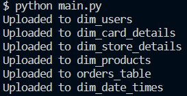
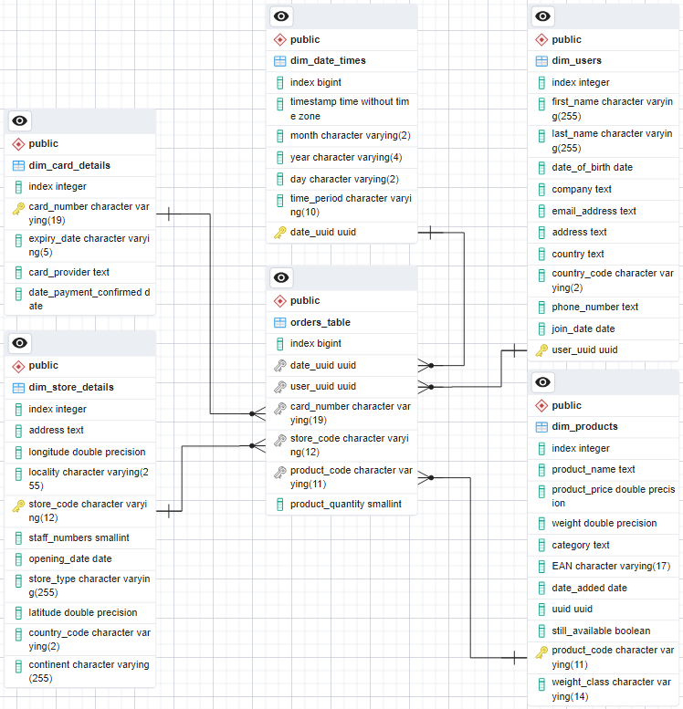

# Multinational Retail Data Centralisation
## Introduction
For a multinational company selling various goods across the globe, sales data can be stored in many different places, making it inconvenient and difficult for it to be accessed for analysis by current members of the team.

The company desires to make this data more accessible, so this project aims to centralise this data in one location. All the sales data from different sources is collected into one database, which can then be queried to provide up-to-date metrics for business.

The project is part of the AiCore Cloud Engineering bootcamp.

### Project Aims
This project aims to create a pipeline which extracts data from various sources (including an AWS RDS database, PDFs, AWS S3 buckets, and an API), cleans this data, then uploads it to a postgreSQL database to act as a single source of truth for sales data, providing convenient access to the company's sales information.

Completing the project has consolidated my skills in data engineering, including working with AWS RDS databases and S3 buckets, API calls, and data stored in different file types. I have gained skills in using pandas to clean data and using SQL to manage and query databases.

## Installation Instructions
### Required Software:
- [Python 3.8+](https://www.python.org/downloads/)
- [Java 8+](https://www.java.com/en/download/manual.jsp)
- [PostgreSQL and pgAdmin4](https://www.enterprisedb.com/downloads/postgres-postgresql-downloads)
- Configured [AWS CLI](https://aws.amazon.com/cli/)
- Optional: VSCode with SQLTools extension

### AWS CLI Configuration
An [Amazon Web Services account](https://aws.amazon.com/) is required.

1. Login to the AWS account.
2. Navigate to the IAM console.
3. Generate an access key and a secret access key, and save the credentials.
4. After downloading and installing the AWS CLI, open a command prompt terminal and run `aws configure`.
5. Enter the information required.
6. To verify successful configuration run `aws configure list` which should display the configuration settings.

### Package Installation
Modules used include Numpy, Pandas, Requests, SQLAlchemy, pyYAML, tabula-py, and boto3.

The most straightforward approach is to download and install [Anaconda](https://www.anaconda.com/download) which contains some required packages such as Pandas and Numpy.

Otherwise:

```sh
pip install numpy
```

```sh
pip install pandas
```

Run the following commands in the terminal:

```sh
pip install SQLAlchemy
```

```sh
pip install requests
```

```sh
pip install pyYAML
```

```sh
pip install tabula-py[jpype]
```

```sh
pip install boto3
```

### Setup
1. Clone the repository:

```sh
git clone https://github.com/rakin-c/multinational-retail-data-centralisation
```

2. Make sure packages and dependencies mentioned [above](#installation-instructions) are installed.

3. Create a database using pgAdmin4 named `sales_data`.

4. Optional: connect to `sales_data` in VSCode using SQLTools.

## Usage Instructions
### Uploading to the Database
After following the setup instructions, navigate to the respository and run the following command in the terminal:

```sh
python main.py
```

The `main.py` file executes the entire pipeline for all the data sources, extracting the data, cleaning it, and uploading it to the `sales_data` database. It creates six different tables in the database.

The output should look like this in the terminal, specifying the table name that the data has been uploaded to. 



Verify that the tables have been uploaded to the database in pgAdmin4.

### Creating the Database Schema
After all the tables have been created in the database, there are two options available. Either running the queries directly in pgAdmin4's query tool, or running them from VSCode using SQLTools.

Run each query in the `schema_queries.sql` file sequentially in order to cast the columns of each table to the correct data types. A `weight_class` column is added to the `dim_products` table to categorise product weights.

Primary keys are added to each of the tables beginning with `dim`, which are used as a reference for columns in `orders_table`. Then, foreign key constraints are added to the corresponding columns in `orders_table` to finalise the star-based schema for the database.

### Querying the Database for Sales Data
Once the database schema is created, run the queries in `sales_data_queries.sql`. Again, this can be done either in VSCode or pgAdmin4.

The SQL code in this file answers nine questions about the company:

1. How many stores does the business have and in which countries?

2. Which locations currently have the most stores?

3. Which months produced the largest amount of sales?

4. How many sales are coming from online?

5. What percentage of sales come through each type of store?

6. Which month in each year produced the highest cost of sales?

7. What is the staff headcount?

8. Which German store type is selling the most?

9. How quickly is the company making sales?

## Structure
### File Structure
The repository consists of six main files.

> **`database_utils.py`** 

Contains the DatabaseConnector class, used for handling connection to databases, as well as as reading the table names from those databases and uploading cleaned data to them.

> **`data_extraction.py`**

Contains the DataExtractor class, used to extract data from different sources. These sources include:

- An AWS RDS database,
- API endpoints,
- Various file types located within S3 buckets:
    - Tables in a PDF document,
    - `csv` files,
    - `json` files.

> **`data_cleaning.py`**

Contains the DataCleaning class, which contains methods used to clean the data from each source.

> **`main.py`**

Contains classes associated with each table of data to be extracted and uploaded to `sales_data`. When the script is run, it performs the extraction, cleaning, and uploading process for each table.

> **`schema_queries.sql`**

An sql file containing queries required to create the star_based database schema. 

> **`sales_data_queries.sql`**

An sql file containing queries to return tables answering sales related questions.

### Database Structure
Below is the Entity Relationship Diagram for the `sales_data` database.



## License
This is free and unencumbered software released into the public domain.

Anyone is free to copy, modify, publish, use, compile, sell, or
distribute this software, either in source code form or as a compiled
binary, for any purpose, commercial or non-commercial, and by any
means.

In jurisdictions that recognize copyright laws, the author or authors
of this software dedicate any and all copyright interest in the
software to the public domain. We make this dedication for the benefit
of the public at large and to the detriment of our heirs and
successors. We intend this dedication to be an overt act of
relinquishment in perpetuity of all present and future rights to this
software under copyright law.

THE SOFTWARE IS PROVIDED "AS IS", WITHOUT WARRANTY OF ANY KIND,
EXPRESS OR IMPLIED, INCLUDING BUT NOT LIMITED TO THE WARRANTIES OF
MERCHANTABILITY, FITNESS FOR A PARTICULAR PURPOSE AND NONINFRINGEMENT.
IN NO EVENT SHALL THE AUTHORS BE LIABLE FOR ANY CLAIM, DAMAGES OR
OTHER LIABILITY, WHETHER IN AN ACTION OF CONTRACT, TORT OR OTHERWISE,
ARISING FROM, OUT OF OR IN CONNECTION WITH THE SOFTWARE OR THE USE OR
OTHER DEALINGS IN THE SOFTWARE.

For more information, please refer to <https://unlicense.org>